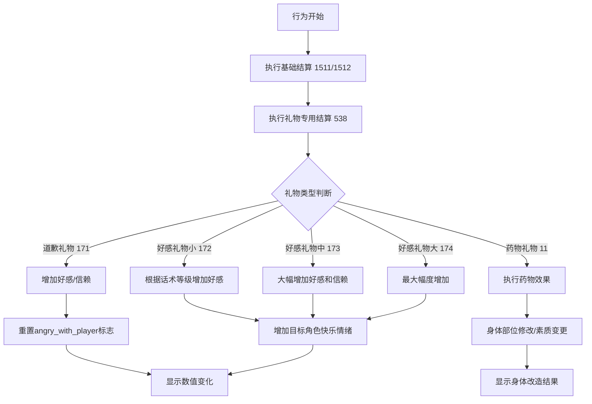
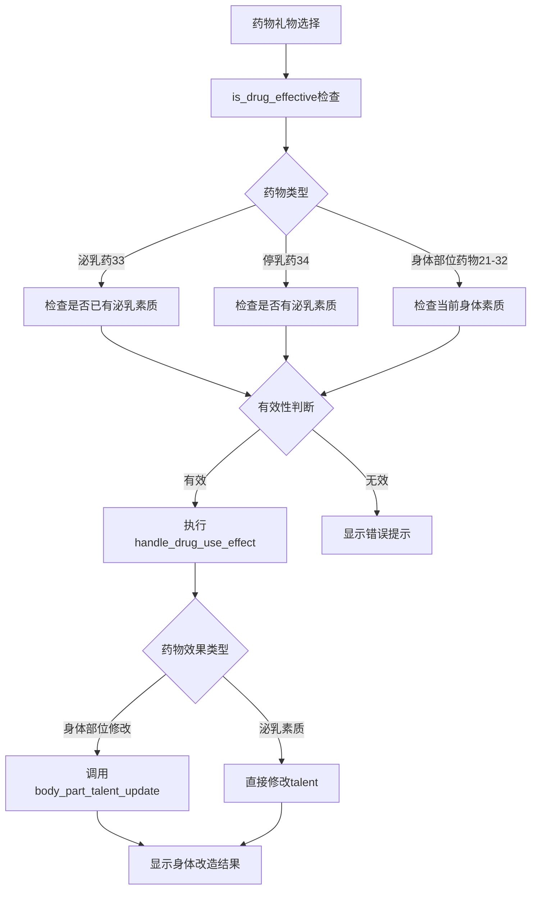

# 礼物系统说明

## 概述

礼物系统是erArk游戏中的一个重要交互功能，允许玩家向NPC角色赠送各种类型的礼物以改善关系、表达歉意、增进好感或对角色使用药物进行身体改造。该系统涉及多个代码文件、数据配置和结算逻辑的协调工作。

## 核心组件

### 1. 主要代码文件

#### 1.1 UI面板 - `Script/UI/Panel/gift_panel.py`
- **类名**: `Gift_Panel`
- **功能**: 提供礼物赠送的用户界面，支持普通礼物和药物类礼物
- **主要方法**:
  - `__init__(width)`: 初始化面板绘制对象，设置药物礼物展开状态
  - `draw()`: 绘制礼物选择界面，显示可用礼物列表，支持药物类展开/收起
  - `select_gift(gift_id)`: 处理礼物选择逻辑，执行赠送行为，包含药物有效性检查
  - `toggle_drug_gift()`: 切换药物类礼物的展开/收起状态
  - `is_drug_effective()`: 检查药物对目标角色的有效性
- **独立函数**:
  - `handle_drug_use_effect(character_id, drug_id)`: 处理药物使用后的身体改造效果

#### 1.2 指令处理 - `Script/Design/handle_instruct.py`
- **装饰器**: `@add_instruct`
- **指令ID**: `constant.Instruct.GIVE_GIFT`
- **行为ID**: `constant.Behavior.GIVE_GIFT`
- **函数**: `handle_give_gift()` - 处理赠送礼物指令，创建礼物面板

#### 1.3 结算系统 - `Script/Settle/default.py`
- **装饰器**: `@settle_behavior.add_settle_behavior_effect`
- **效果ID**: `constant_effect.BehaviorEffect.FAVORABILITY_GIFT_ADD_ADJUST`
- **函数**: `handle_favorability_gift_add_adjust()` - 处理礼物赠送的数值结算

### 2. 数据配置文件

#### 2.1 礼物物品配置 - `data/csv/Gift_Items.csv`
```csv
cid,item_id,type,todo,info
编号id,道具id,礼物类型,是否未实装,描述
```

**礼物类型说明**:
- `type = 2`: 道歉礼物 (item_id = 171)
- `type = 3`: 好感礼物 (item_id = 172/173/174 对应小/中/大)
- `type = 4`: 节日礼物 (未实装)
- `type = 11`: 药物类礼物 (已实装)
  - id = 21: 丰胸药 - 增加胸部大小
  - id = 22: 缩胸药 - 减少胸部大小
  - id = 23: 丰臀药 - 增加臀部大小
  - id = 24: 缩臀药 - 减少臀部大小
  - id = 25: 丰腿药 - 增加腿部粗细
  - id = 26: 瘦腿药 - 减少腿部粗细
  - id = 27: 丰足药 - 增加足部大小
  - id = 28: 瘦足药 - 减少足部大小
  - id = 31: 外表年龄增长药 - 增加外表年龄
  - id = 32: 外表年龄减少药 - 减少外表年龄
  - id = 33: 泌乳药 - 获得泌乳素质
  - id = 34: 停乳药 - 失去泌乳素质
- `type = 12`: 服装 (未实装)
- `type = 13`: 自己的阴茎倒模 (未实装)

#### 2.2 行为效果配置 - `data/csv/Behavior_Effect.csv`
```csv
120,give_gift,1511 - 1512 - 538
```
- `1511`: 基础结算效果
- `1512`: 基础结算效果
- `538`: 礼物好感度调整效果 (`FAVORABILITY_GIFT_ADD_ADJUST`)

#### 2.3 行为数据配置 - `data/csv/Behavior_Data.csv`
```csv
120,give_gift,赠送礼物,5,pl,日常
```
- 行为持续时间: 5分钟
- 执行者类型: pl (玩家)
- 分类: 日常

### 3. 对话文本配置

#### 3.1 道歉礼物对话 - `data/talk/daily/give_gift_apology.csv`
- 包含不同年龄段、角色类型的道歉礼物赠送文本
- 根据角色年龄 (102-107) 和特殊身份 (女儿关系) 提供不同的对话内容
- 前提条件: `CVP_A1_Gift|2_G_0` (道歉礼物类型)

#### 3.2 好感礼物对话 - `data/talk/daily/give_gift_favorability.csv`
- 包含好感礼物赠送的详细描述文本
- 根据角色关系和年龄提供不同的互动描述
- 前提条件: `CVP_A1_Gift|6_G_0`, `CVP_A1_Gift|7_G_0`, `CVP_A1_Gift|8_G_0` (好感礼物小/中/大)

## 系统工作流程

### 1. 礼物赠送流程

```mermaid
graph TD
    A[玩家选择赠送礼物指令] --> B[handle_give_gift()]
    B --> C[创建Gift_Panel]
    C --> D[显示可用礼物列表]
    D --> D1{药物类礼物}
    D1 -->|展开| D2[显示所有药物]
    D1 -->|收起| D3[隐藏药物类]
    D2 --> E[玩家选择具体礼物]
    D3 --> E
    E --> F[select_gift()]
    F --> G[礼物类型检查]
    G --> H{礼物类型}
    H -->|道歉礼物| I[检查对象是否生气/反发刻印等级]
    H -->|好感礼物| J[检查今日是否已赠送]
    H -->|药物礼物| K[检查药物有效性]
    I --> L[扣除物品数量]
    J --> L
    K --> K1{药物有效性}
    K1 -->|有效| L
    K1 -->|无效| K2[显示无效提示并返回]
    L --> M[设置behavior.gift_id]
    M --> N[执行行为结算]
    N --> O{是否为药物}
    O -->|是| P[执行药物效果]
    O -->|否| Q[触发对话文本]
    P --> R[身体改造效果显示]
```

### 2. 结算系统流程



### 3. 药物效果处理流程



### 4. 前提条件检查

#### 4.1 指令前提条件
- `HAVE_TARGET`: 需要有交互对象
- `TIRED_LE_84`: 疲劳度不超过84
- `NOT_H`: 不在H状态
- `NOT_SHOW_NON_H_IN_HIDDEN_SEX`: 隐性行为时不显示非H指令

#### 4.2 礼物特殊限制
- **道歉礼物**: 
  - 对象必须生气 (`ability[18] > 0` 或 `sp_flag.angry_with_player = True`)
  - 反发刻印等级不能大于等于2级
  - 使用后会将反发刻印从1级降为0级
- **好感礼物**: 
  - 每天只能赠送一次
  - 通过 `action_info.last_gift_time` 记录上次赠送时间
- **药物礼物**:
  - 泌乳药：目标必须没有泌乳素质
  - 停乳药：目标必须有泌乳素质
  - 身体部位修改药物：根据目标当前素质状态判断是否可以继续改造
  - 外表年龄药物：根据目标当前年龄段判断是否可以继续改变

## UI界面特性

### 1. 药物类礼物展开/收起功能
- **展开状态**: 显示 `▼药物类` 按钮，所有药物礼物可见
- **收起状态**: 显示 `▶药物类` 按钮，药物礼物隐藏
- **状态管理**: 通过 `show_drug_gift` 布尔变量控制
- **用户体验**: 减少界面混乱，按需显示药物选项

### 2. 礼物状态显示
- **可用礼物**: 显示为可点击按钮，包含礼物编号、名称和描述
- **数量不足**: 显示为灰色文本，添加 "(未拥有)" 标记
- **未实装礼物**: 显示为灰色文本，添加 "(未实装)" 标记
- **编号格式**: 使用 `str(gift_id).rjust(2,'0')` 格式化为两位数编号

### 3. 交互流程优化
- **实时检查**: 每次打开面板时重新检查物品持有数量
- **错误提示**: 药物无效或条件不符时给出明确提示
- **返回机制**: 提供返回按钮，支持取消操作

## 数据结构关联

### 1. 角色数据结构
```python
character_data.item[item_id]  # 物品持有数量
character_data.behavior.gift_id  # 当前赠送的礼物ID
character_data.target_character_id  # 目标角色ID
target_data.action_info.last_gift_time  # 上次收到礼物的时间
target_data.ability[18]  # 反发刻印等级 (怒气相关)
target_data.sp_flag.angry_with_player  # 是否对玩家生气
target_data.talent[27]  # 泌乳素质 (药物相关)
target_data.talent[121-125]  # 胸部大小素质 (丰胸/缩胸药相关)
target_data.talent[126-128]  # 臀部大小素质 (丰臀/缩臀药相关)
target_data.talent[129-130]  # 腿部粗细素质 (丰腿/瘦腿药相关)
target_data.talent[131-132]  # 足部大小素质 (丰足/瘦足药相关)
target_data.talent[103-107]  # 外表年龄素质 (年龄药物相关)
```

### 2. 配置数据关联
```python
game_config.config_gift_items[gift_id]  # 礼物配置
game_config.config_item[item_id]  # 物品配置
gift_panel.show_drug_gift  # 药物类礼物展开状态
panel_info_data  # 面板信息数据字典
```

## 扩展性设计

### 1. 新增礼物类型
1. 在 `Gift_Items.csv` 中添加新的礼物配置
2. 在 `handle_favorability_gift_add_adjust()` 中添加对应的结算逻辑
3. 在对话文件中添加对应的文本内容
4. 对于药物类礼物，需要在 `handle_drug_use_effect()` 中添加对应的效果处理
5. 在 `is_drug_effective()` 中添加有效性检查逻辑

### 2. 药物系统实现要点
1. **身体部位修改药物** (ID: 21-32):
   - 使用 `handle_talent.body_part_talent_update()` 进行素质修改
   - 支持增加和减少两个方向的修改
   - 涉及胸部、臀部、腿部、足部、外表年龄等素质
2. **特殊素质药物** (ID: 33-34):
   - 直接操作 `character_data.talent[27]` 泌乳素质
   - 二进制开关式素质，0表示无，1表示有
3. **有效性检查**:
   - 泌乳药需要目标没有泌乳素质
   - 停乳药需要目标有泌乳素质
   - 身体部位药物需要检查当前素质是否可以继续修改

### 3. 新增前提条件
- 在指令装饰器的前提集合中添加新的前提条件
- 实现对应的前提检查函数

### 4. 自定义结算效果
- 在 `constant_effect.py` 中定义新的效果ID
- 在 `default.py` 中实现对应的结算函数
- 在 `Behavior_Effect.csv` 中配置行为与效果的关联

## 注意事项

### 1. 性能考虑
- 礼物列表会实时检查物品持有数量，避免显示无法使用的礼物
- 前提条件检查在UI渲染前执行，提高用户体验
- 药物类礼物支持展开/收起功能，减少界面混乱

### 2. 数据一致性
- 礼物ID和物品ID的映射关系需要保持一致
- 对话文本的前提条件需要与礼物类型匹配

### 3. 错误处理
- 礼物数量不足时会显示灰色文本而非按钮
- 未实装的礼物会显示特殊标记
- 药物无效时会显示相应提示信息并阻止使用
- 道歉礼物在不符合条件时会给出明确的错误提示

### 4. 本地化支持
- 所有用户显示文本都通过 `get_text._()` 函数进行翻译
- 对话文本支持多语言配置

## 相关系统

- **物品系统**: 礼物本质上是特殊的物品，需要消耗物品数量
- **好感度系统**: 礼物赠送会影响角色的好感度和信赖度
- **时间系统**: 好感礼物有每日一次的限制
- **前提系统**: 控制礼物赠送的可用性
- **对话系统**: 提供赠送时的互动文本
- **行为系统**: 礼物赠送作为一种行为参与游戏的行为循环
- **素质系统**: 药物类礼物会直接修改角色的身体素质
- **天赋系统**: 药物类礼物通过 `handle_talent.body_part_talent_update()` 进行身体改造