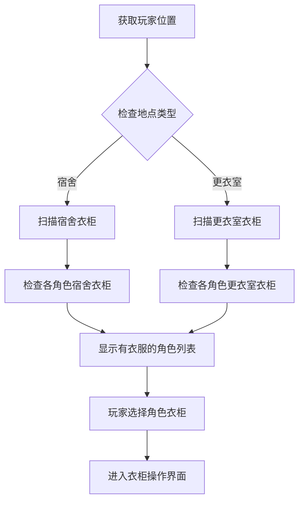
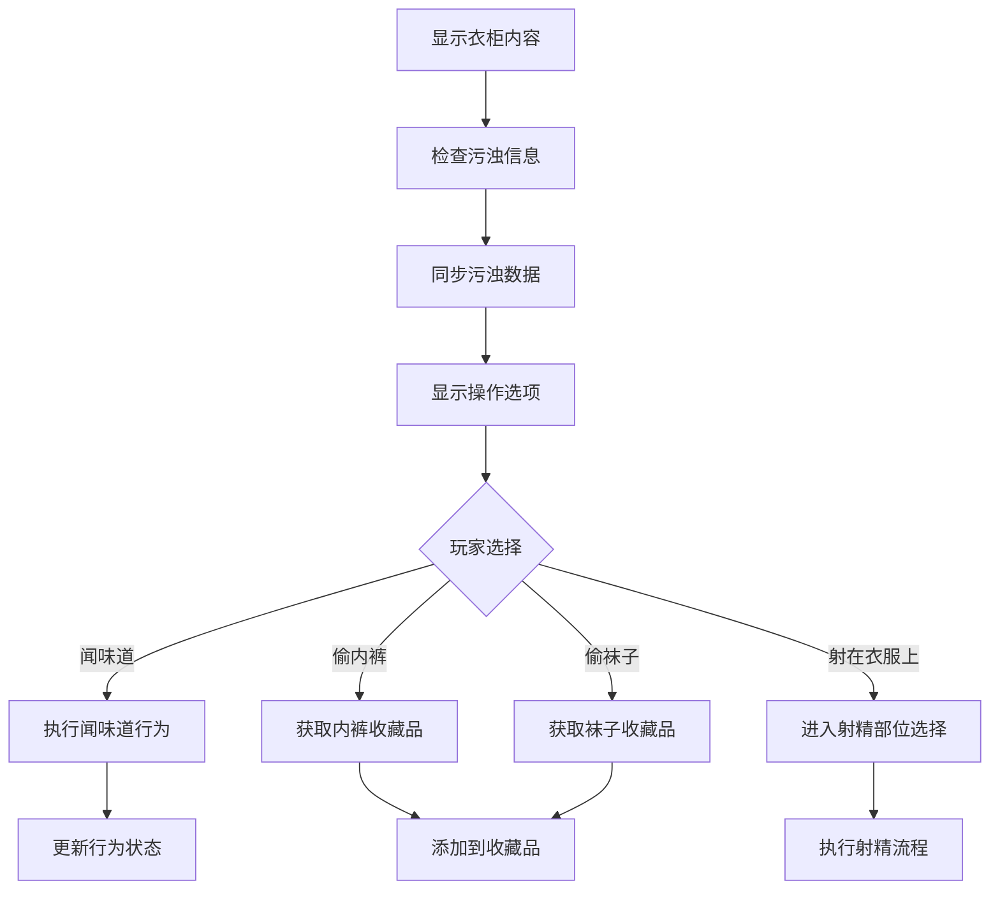

# 衣柜检查系统说明

## 系统概述

衣柜检查系统（`check_locker_panel.py`）是erArk游戏中的一个重要功能模块，允许玩家检查和操作各个角色在不同地点（宿舍、更衣室）衣柜中的服装物品。该系统涉及服装管理、收藏品获取、以及特殊互动行为等功能。

## 核心文件位置

- **主文件**: `Script/UI/Panel/check_locker_panel.py`
- **数据结构**: `Script/Core/game_type.py` (CLOTH、DIRTY类)
- **配置数据**: `data/csv/ClothingType.csv`, `data/csv/ClothingTem.csv`
- **射精系统**: `Script/UI/Panel/ejaculation_panel.py`

## 系统架构

### 1. 主要类结构

#### Check_locker_Panel (主面板类)
- **功能**: 管理衣柜检查的主界面，显示所有有衣服存放的角色衣柜
- **核心属性**:
  - `width`: 绘制宽度
  - `handle_panel`: 页面控制面板，用于显示角色列表

#### FindDraw (角色衣柜显示类)
- **功能**: 显示可点击的NPC衣柜按钮，管理单个角色的衣柜操作
- **核心属性**:
  - `npc_id`: 角色ID
  - `character_data`: 角色数据
  - `now_locker`: 当前操作的衣柜（宿舍或更衣室）

#### Ejaculation_NameDraw (射精部位选择类)
- **功能**: 处理在衣服上射精的部位选择和执行
- **核心属性**:
  - `index`: 部位ID
  - `locker_type`: 衣柜类型（2=更衣室，3=宿舍）

### 2. 数据结构关系

#### CLOTH类 (game_type.py:384)
```python
class CLOTH:
    def __init__(self):
        self.cloth_locker_in_shower: Dict[int, List] = {}     # 更衣室衣柜
        self.cloth_locker_in_dormitory: Dict[int, List] = {}  # 宿舍衣柜
        self.cloth_wear: Dict[int, List] = {}                 # 穿着的服装
        self.cloth_off: Dict[int, List] = {}                  # 脱下的服装
        # ...其他属性
```

#### DIRTY类 (game_type.py:274)
```python
class DIRTY:
    def __init__(self):
        self.cloth_locker_semen: dict = {}  # 衣柜服装精液情况
        # 格式: 编号int:[0部位名str,1当前精液量int,2等级int,3总量int]
```

## 系统流程

### 1. 衣柜检测流程 (Check_locker_Panel.draw())



#### 检测逻辑（第53-73行）：
- **宿舍模式**: 检查`cache.scene_data[map_path_str].scene_tag`包含"Dormitory"
- **更衣室模式**: 检查包含"Locker_Room"
- **扫描条件**: 遍历所有NPC，检查对应衣柜中是否有任何类型的服装

### 2. 衣柜操作流程 (FindDraw.check_cloth())



## 关键功能实现

### 1. 污浊信息同步 (第174-181行)

系统会检查衣柜中服装的污浊信息，如果缺失会自动补充：

```python
# 检查是否有该衣服的污浊信息，如果没有的话则补上
if len(self.character_data.dirty.cloth_locker_semen) <= clothing_type:
    # 尝试从角色身上的服装污浊信息同步
    if len(self.character_data.dirty.cloth_semen[clothing_type]):
        self.character_data.dirty.cloth_locker_semen = self.character_data.dirty.cloth_semen
    # 如果为空，则创建新的污浊记录
    else:
        part_name = game_config.config_clothing_type[clothing_type].name
        self.character_data.dirty.cloth_locker_semen.append([part_name,0,0,0])
```

### 2. 收藏品获取机制

#### 内裤获取 (get_pan())
```python
def get_pan(self):
    pan_id = self.now_locker[9][-1]  # 获取内裤ID（类型9）
    pan_name = game_config.config_clothing_tem[pan_id].name
    self.pl_data.pl_collection.npc_panties_tem.setdefault(self.npc_id, [])
    self.pl_data.pl_collection.npc_panties_tem[self.npc_id].append(pan_id)
    self.now_locker[9] = []  # 清空衣柜中的内裤
```

#### 袜子获取 (get_socks())
```python
def get_socks(self):
    socks_id = self.now_locker[10][-1]  # 获取袜子ID（类型10）
    socks_name = game_config.config_clothing_tem[socks_id].name
    self.pl_data.pl_collection.npc_socks_tem.setdefault(self.npc_id, [])
    self.pl_data.pl_collection.npc_socks_tem[self.npc_id].append(socks_id)
    self.now_locker[10] = []  # 清空衣柜中的袜子
```

### 3. 特殊行为处理

#### 闻味道行为 (smell())
```python
def smell(self):
    self.pl_data.behavior.duration = 1
    self.pl_data.behavior.behavior_id = constant.Behavior.SMELL_UNDERWEAR
    self.pl_data.state = constant.CharacterStatus.STATUS_SMELL_UNDERWEAR
    update.game_update_flow(1)
```

## 配置文件依赖

### 1. ClothingType.csv
定义服装类型和容积流通规则：
- **cid**: 配表ID（0-13，对应帽子到附属物）
- **name**: 部位名称
- **volume_table**: 容积表（定义污浊容量等级）
- **flow_table**: 流通表（定义污浊流通规则）

### 2. 服装类型映射
```
0: 帽子     1: 眼镜     2: 耳饰     3: 脖饰
4: 口饰     5: 上衣     6: 胸衣     7: 手套  
8: 下衣     9: 内裤     10: 袜子    11: 鞋子
12: 武器    13: 附属物
```

## 与其他系统的交互

### 1. 射精系统集成
- 调用`ejaculation_panel.ejaculation_flow()`处理射精逻辑
- 支持在特定服装部位射精
- 更新衣柜中服装的污浊状态

### 2. 收藏品系统
- 将获取的内裤/袜子添加到`pl_collection`
- 支持在藏品馆中查看收藏

### 3. 行为系统
- 集成角色行为状态管理
- 支持特殊行为（如闻味道）的持续时间和效果

### 4. 地图系统
- 基于当前场景标签判断衣柜类型
- 支持宿舍和更衣室两种不同的衣柜管理

## 技术特点

### 1. 模块化设计
- 主面板、角色衣柜、射精选择分别用独立类管理
- 清晰的职责分离和接口设计

### 2. 数据一致性
- 自动同步和补充污浊信息
- 确保衣柜数据的完整性

### 3. 用户体验
- 分页显示支持大量角色
- 直观的按钮操作界面
- 清晰的状态反馈

### 4. 扩展性
- 支持新增服装类型
- 灵活的污浊系统配置
- 可扩展的特殊行为

## 开发注意事项

1. **数据安全**: 操作衣柜数据时需要确保数据完整性
2. **性能优化**: 大量角色时需要考虑分页加载
3. **状态同步**: 确保衣柜状态与角色状态的一致性
4. **错误处理**: 处理服装ID不存在等异常情况
5. **UI适配**: 支持不同分辨率的界面显示

## 未来扩展方向

1. **衣柜管理**: 支持衣柜整理、分类功能
2. **批量操作**: 支持批量获取、清理功能  
3. **更多互动**: 增加更多衣柜相关的特殊行为
4. **智能推荐**: 基于角色喜好推荐衣柜内容
5. **历史记录**: 记录衣柜操作历史