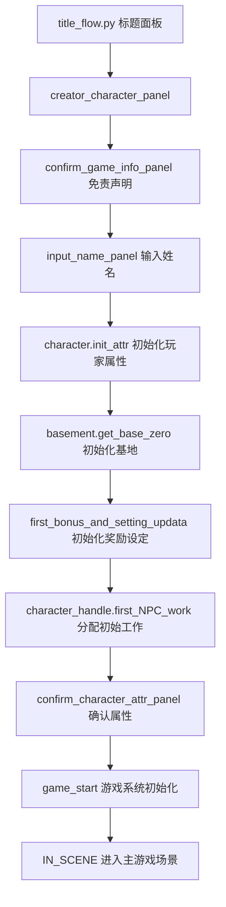

# 角色创建流程

## 概述

`creator_character_flow.py` 是 erArk 游戏的角色创建系统核心文件，负责整个游戏的初始化流程，从玩家角色创建到游戏世界的完整初始化。该文件是游戏启动后的第一个重要面板，承担着构建整个游戏世界的重要责任。

## 文件结构与核心组件

### 主要函数

1. **creator_character_panel()** - 角色创建主面板，整个创建流程的入口点
2. **first_bonus_and_setting_updata()** - 初始化奖励和设定系统
3. **game_start()** - 游戏系统初始化，完成所有必要的游戏数据准备
4. **confirm_game_info_panel()** - 游戏免责声明确认面板
5. **confirm_character_attr_panel()** - 角色属性确认面板
6. **input_name_panel()** - 角色姓名输入面板

### 主要类

1. **Character_creat_Handle** - 角色创建页面主控制器
2. **Character_Sex** - 性别选择面板
3. **Character_JJ** - 阴茎大小设置面板（男性角色）
4. **Character_Debug** - Debug模式切换面板
5. **Character_FirstNPC** - 初始干员选择面板（核心复杂组件）
6. **Character_Bonus** - 初始奖励选择面板
7. **World_Setting** - 世界设定面板
8. **Other_Settings** - 其他设定面板
9. **SelectFirstNPCButton** - NPC选择按钮组件

## 数据流程

### 1. 角色创建主流程



### 2. 数据初始化顺序

#### 第一阶段：基础数据准备
- `cache.character_data[0] = game_type.Character()` - 创建空的玩家角色对象
- `character_handle.init_character_list()` - 初始化所有NPC模板数据

#### 第二阶段：玩家角色设定
- `character.init_attr(0)` - 初始化玩家属性（HP/MP/理智值等）
- 玩家设定选择：性别、阴茎大小、debug模式等

#### 第三阶段：系统与资源初始化
- `cache.rhodes_island = basement.get_base_zero()` - 初始化罗德岛基地
- `first_bonus_and_setting_updata()` - 设置初始奖励和世界设定
- 初始资源分配：20000 LMD，20个材料

#### 第四阶段：NPC与设施初始化
- 初始干员选择（基础4人 + 自选最多6人）
- `character_handle.first_NPC_work()` - 分配初始工作岗位
- `init_character_facility_open()` - 根据NPC开启设施

#### 第五阶段：游戏世界构建
- `game_start()` 函数中完成所有游戏系统的最终初始化
- 角色宿舍分配、位置设定、娱乐设定等
- 料理系统、食堂商店初始化
- 系统设定应用

## 核心系统关系

### 与其他文件的关系

#### 导入的核心模块
- **Script.Core.cache_control** - 游戏缓存数据管理
- **Script.Design.character_handle** - 角色处理逻辑
- **Script.Design.character** - 角色基础功能
- **Script.Design.basement** - 基地管理系统
- **Script.Config.game_config** - 游戏配置数据
- **Script.UI.Panel系列** - 各种UI面板组件

#### 被调用的重要函数
- `character_handle.init_character_list()` - 加载所有NPC模板
- `character.init_attr(0)` - 初始化玩家属性
- `basement.get_base_zero()` - 创建初始基地状态
- `character_handle.first_NPC_work()` - 分配工作岗位
- `cooking.init_recipes()` - 初始化料理配方
- `attr_calculation.get_system_setting_zero()` - 获取系统设定默认值

### 配置文件依赖

#### CSV数据源
- **data/character/*.csv** - 所有角色模板数据
- **data/csv/First_Bouns.csv** - 初始奖励配置
- **data/csv/World_Setting.csv** - 世界设定配置
- **data/csv/Talent.csv** - 天赋配置
- **data/csv/Race.csv** - 种族配置

#### JSON数据文件
- **data/Character.json** - 编译后的角色数据
- **data/data.json** - 主要游戏数据

### 缓存数据结构

#### 主要缓存变量
- `cache.character_data` - 所有角色对象（0=玩家，1+=NPC）
- `cache.npc_id_got` - 已招募的NPC ID集合
- `cache.rhodes_island` - 罗德岛基地状态对象
- `cache.first_bonus` - 已选择的初始奖励
- `cache.world_setting` - 世界设定标志
- `cache.debug_mode` - Debug模式状态
- `cache.game_round` - 游戏周目数

## 初始NPC选择系统

### Character_FirstNPC 类详解

这是整个角色创建流程中最复杂的组件，负责处理初始干员的选择：

#### 核心功能
1. **基础干员自动添加** - 阿米娅、凯尔希、特蕾西娅、杜宾
2. **自选干员** - 玩家可选择最多6个额外干员
3. **多重过滤系统** - 按口上、姓名、胸围、年龄、种族筛选
4. **特殊角色处理** - 某些角色初期不可选但有口上

#### 过滤器系统
- **口上过滤** - 根据 `character.talk_size` 筛选有对话文本的角色
- **姓名过滤** - 支持模糊搜索角色名称
- **胸围过滤** - 基于天赋ID 121-125（绝壁到爆乳）
- **年龄过滤** - 基于天赋ID 102-107（幼女到人妻）
- **种族过滤** - 基于 `config_race` 配置

#### 数据流程
```python
# 初始化时
self.id_list = [i + 1 for i in range(len(cache.npc_tem_data))]
# 去除特殊角色
for chara_id in self.id_list.copy():
    if cache.character_data[chara_id].name in constant.ban_NPC_name_set:
        self.id_list.remove(chara_id)
        self.special_chara_list.append(chara_id)
```

## 初始奖励系统

### Character_Bonus 类详解

#### 奖励点数计算
- 基础点数：`cache.game_round * 20`（周目数乘以20）
- Debug模式额外999点
- 每选择一个奖励消耗对应点数

#### 可选奖励类型

##### 特殊天赋（10点）
- **博士信息素**（天赋304）
- **X光视线**（天赋307）
- **催眠术**（天赋331）
- **时停**（天赋316）

##### 初始资源（5点）
- 大量启动资金（70000 LMD）
- 额外材料和合成玉

##### 自选专精（5点）
- 选择一个能力达到5级
- 通过 `normal_panel.Chose_First_bonus_ability_Panel` 选择

##### 助理干员（5点）
- 选择一个初始助理
- 自动设置好感度1000，信赖度50

## 世界设定系统

### World_Setting 类

负责配置游戏世界的基础设定，影响整个游戏的角色行为和事件触发：

#### 主要设定类型
- 角色年龄修正
- 角色性格特征
- 特殊剧情线开启
- 游戏难度调整

这些设定在 `character_handle.handle_character_setting()` 中应用到所有角色。

## 游戏系统初始化详解

### game_start() 函数

这是从角色创建转入正式游戏的关键函数：

#### 初始化顺序
1. **角色住宿系统** - `init_character_dormitory()` 分配宿舍
2. **角色位置系统** - `init_character_position()` 设置初始位置
3. **设施开放系统** - `init_character_facility_open()` 基于NPC开启设施
4. **角色设定应用** - `handle_character_setting()` 应用世界设定
5. **料理系统** - `cooking.init_recipes()` 和 `init_food_shop_data()`
6. **系统设定** - `attr_calculation.get_system_setting_zero()`
7. **国家关系** - `attr_calculation.get_country_reset()`
8. **基地更新** - `basement.get_base_updata()`
9. **娱乐系统** - `init_character_entertainment()`

## 与主游戏流程的衔接

### 流程控制机制

角色创建完成后，通过 `cache.now_panel_id = constant.Panel.IN_SCENE` 切换到主游戏场景。

### 数据传递机制

所有在角色创建阶段初始化的数据都存储在 `cache_control.cache` 中，主游戏的各个系统直接从缓存读取：

- **角色行为系统** 从 `cache.character_data` 读取角色状态
- **基地管理系统** 从 `cache.rhodes_island` 读取基地状态
- **时间系统** 开始驱动NPC的自主行为
- **事件系统** 基于角色关系和设定触发事件

## 开发注意事项

### 扩展角色创建功能
1. 新增配置项需要在对应的CSV文件中定义
2. 需要在 `buildconfig.py` 中添加构建逻辑
3. 在对应的类中添加UI处理逻辑
4. 确保在 `game_start()` 中正确初始化

### 调试模式支持
- `cache.debug_mode` 影响多个系统的行为
- Debug模式下可以选择无限数量的NPC
- 提供额外的999奖励点数
- 某些面板只在debug模式下显示

### 性能考虑
- NPC过滤操作在大量角色时可能较慢
- 角色创建过程中避免重复的数据加载
- UI更新采用惰性刷新机制

这个系统设计确保了从零开始构建一个完整的游戏世界，所有必要的数据和系统都在角色创建阶段得到妥善初始化，为后续的游戏流程提供坚实的基础。